# 太极图解

[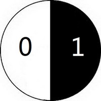](../images/200x200/liangyi-1-0.jpg)

[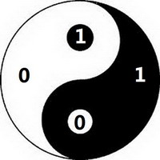](../images/200x200/taiji-1-0.jpg)

[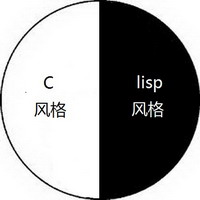](../images/200x200/liangyi-c-lisp.jpg)

[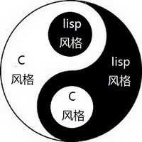](../images/200x200/taiji-c-lisp.jpg)

[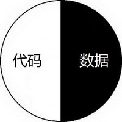](../images/200x200/liangyi-code-data.jpg)

[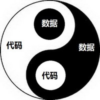](../images/200x200/taiji-code-data.jpg)

[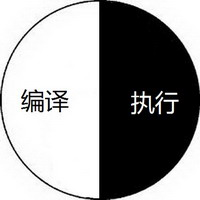](../images/200x200/liangyi-compile-run.jpg)

[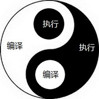](../images/200x200/taiji-compile-run.jpg)

[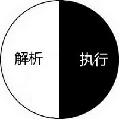](../images/200x200/liangyi-parse-run.jpg)

[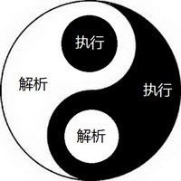](../images/200x200/taiji-parse-run.jpg)

[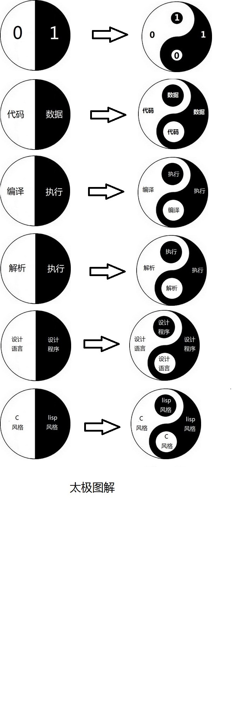](../images/200x200/transform.jpg)

